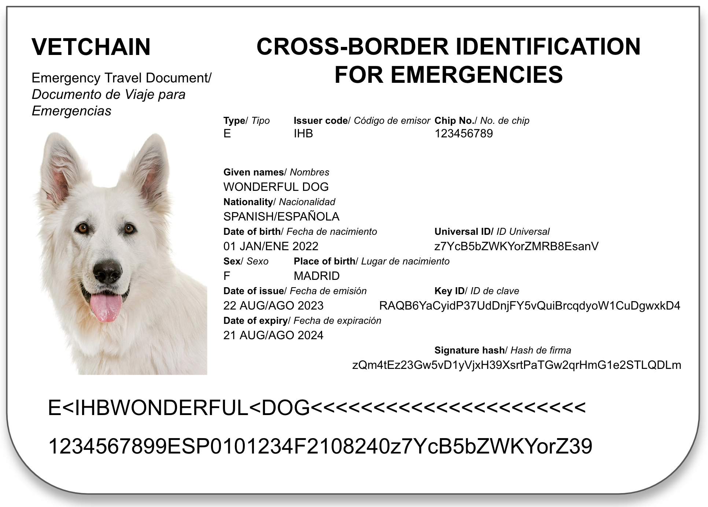

# Vetchain & International Health Booklet (IHB) Documentation

Copyright © CONNECTING SOLUTION & APPLICATIONS LTD.

&nbsp  

## Table of Contents
- [Vetchain \& International Health Booklet (IHB) Documentation](#vetchain--international-health-booklet-ihb-documentation)
  - [Table of Contents](#table-of-contents)
  - [What is VetChain](#what-is-vetchain)
  - [What is the International Health Booklet (IHB)](#what-is-the-international-health-booklet-ihb)
    - [Abstract](#abstract)
    - [Components](#components)
    - [ICAO Emergency Travel Document (ETD) for Cross-Border Care and Emergencies](#icao-emergency-travel-document-etd-for-cross-border-care-and-emergencies)
  - [What is the International Health Card (IHC)](#what-is-the-international-health-card-ihc)
  - [What is the Unified Identification Protocol (UIP)](#what-is-the-unified-identification-protocol-uip)
  - [Advantages of the IHB](#advantages-of-the-ihb)
  - [Use of Blockchain for Identity and Clinical Data Certification](#use-of-blockchain-for-identity-and-clinical-data-certification)
  - [Using Data for Research](#using-data-for-research)

---

## What is VetChain

VetChain is a revolutionary platform aimed at streamlining and standardizing animal health records for international travel. The platform integrates various technologies such as the Unified Identification Protocol (UIP), International Civil Aviation Organization's Emergency Travel Documents (ICAO ETD), HL7's Fast Healthcare Interoperability Resources (FHIR), and Smart Health Cards (SHC) to create a comprehensive solution for animal health management.

---

## What is the International Health Booklet (IHB)

### Abstract

Addressing the growing need for standardized animal health records during international travel, VetChain introduces the International Health Booklet (IHB). The IHB is available in both printed and digital formats through a mobile app. It aims to offer seamless travel experiences for pets while adhering to international standards.

IHB replaces the traditional method of handwriting in paper booklets for animals. Instead, the pages of the physical booklet contain International Health Cards (IHC), providing a secure and standardized way to carry the complete clinical history of animals in a digital format (using QR codes). Whether physical or digital, the IHB enables pet owners to travel and visit veterinarians with all necessary health information readily available in a secure, digital format.

### Components
- Unified Identification Protocol: Verifies and traces the training and health history of animals.
- ICAO Emergency Travel Document: Provides a globally recognized identity verification system for pets.
- HL7 FHIR: Enables real-time access to critical pet health data and facilitates international veterinary communication.
- SMART Health Cards: Encoded in QR format to provide essential health information on demand.

### ICAO Emergency Travel Document (ETD) for Cross-Border Care and Emergencies

The International Civil Aviation Organization's Emergency Travel Document (ICAO ETD) is issued by the UNID Foundation after rigorous data verification by veterinarians. It includes a chip ID and a Universal ID linked to the Universal IDs of the owners. These IDs are securely exchanged using cryptographic keys and DID Documents. The ETD plays a vital role in fast-tracking cross-border procedures and ensuring seamless travel experiences while adhering to international standards.

---

## What is the International Health Card (IHC)

The International Health Card (IHC) is a digital or physical card compatible. Compatible with the SMART Health Card (SHC) standard ([examples](https://spec.smarthealth.cards/examples/)), the IHC provides a comprehensive solution for animal health by constructing and certifying the entire clinical history of an animal.

IHC uniquely uses the patented [Unified Identification Protocol (UIP) for Training and Health](https://image-ppubs.uspto.gov/dirsearch-public/print/downloadPdf/11636776) for the identifiers of both patients, related persons and veterinarians (among others), ensuring a robust identification framework. In the IHC, both clinical and identity data are pseudo-anonymized through hashing but are not fully de-identified, maintaining a balance between privacy and utility.

Pet owners can conveniently obtain an IHC in two ways: either printed by veterinarians using thermal printers onto adhesive cards that fit into the physical booklet, or directly on their mobile phones through VetChain's secure platform. These cards can also be self-printed by the owners, ensuring convenience and accessibility.

---

## What is the Unified Identification Protocol (UIP)

The Unified Identification Protocol for Training and Health (UIP) is a robust framework (patented) designed to verify and trace the health history of animals and the digital identities of both animails, owners and veterinarians. It lays the foundational structure upon which other components like ICAO ETD, HL7 FHIR, and SMART Health Cards standards are integrated to form a comprehensive animal health system.

---

## Advantages of the IHB

The International Health Booklet (IHB) brings several advantages to the table:

1. **Standardized Health Records**: Real-time access to standardized pet health data.
2. **Efficient Diagnosis and Treatment**: Immediate, comprehensive access to an animal's health history.
3. **Global Veterinary Communication**: Enhanced global veterinary communication for better health outcomes.
4. **Traceability and Immutability**: Blockchain technology ensures traceability and immutability of records.
5. **Seamless Cross-Border Procedures**: Adherence to international standards and regulations facilitates smooth travel experiences.

---

## Use of Blockchain for Identity and Clinical Data Certification

Blockchain technology plays a pivotal role in VetChain's IHB system. It hosts the signature for each International Health Card (IHC), ensuring the integrity and immutability of the data. The blockchain also provides a secure and efficient way to manage animal health records, future-proofing the system against advancements in quantum computing.

---

## Using Data for Research

The IHB system offers valuable data sets that can be used for veterinary research and clinical trials. These standardized and robust datasets enable researchers to better understand animal health patterns, ultimately expediting the development and validation of new treatments and therapies.

---
    